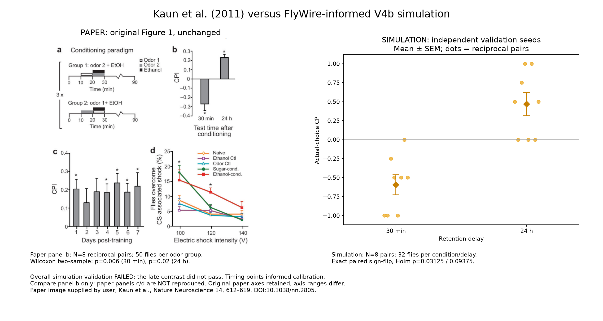
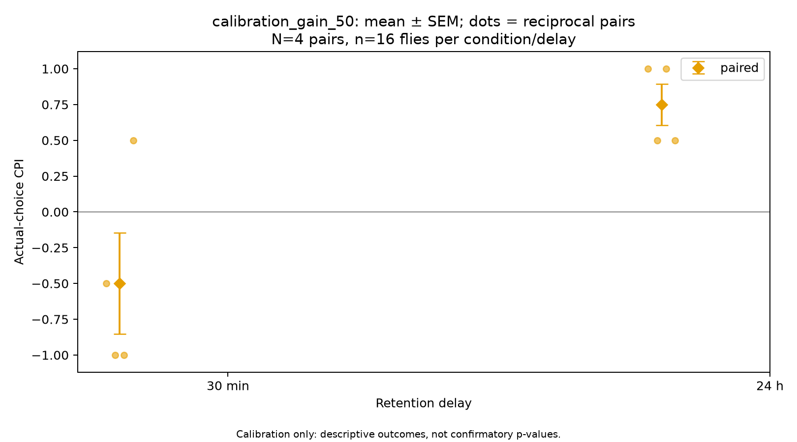
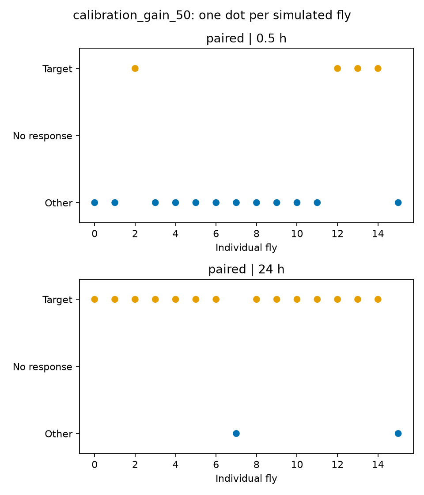
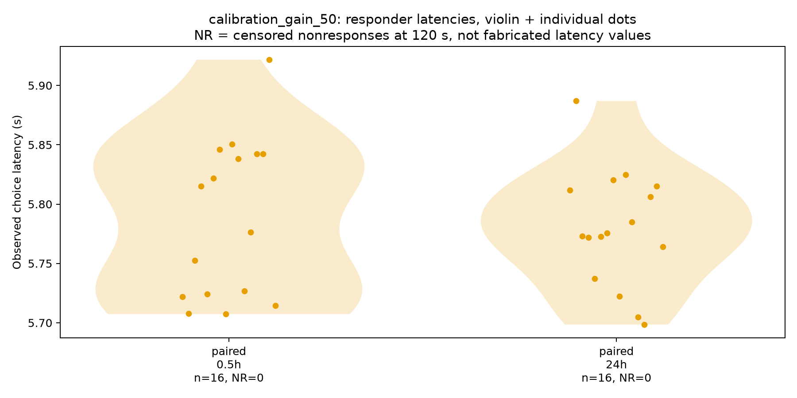
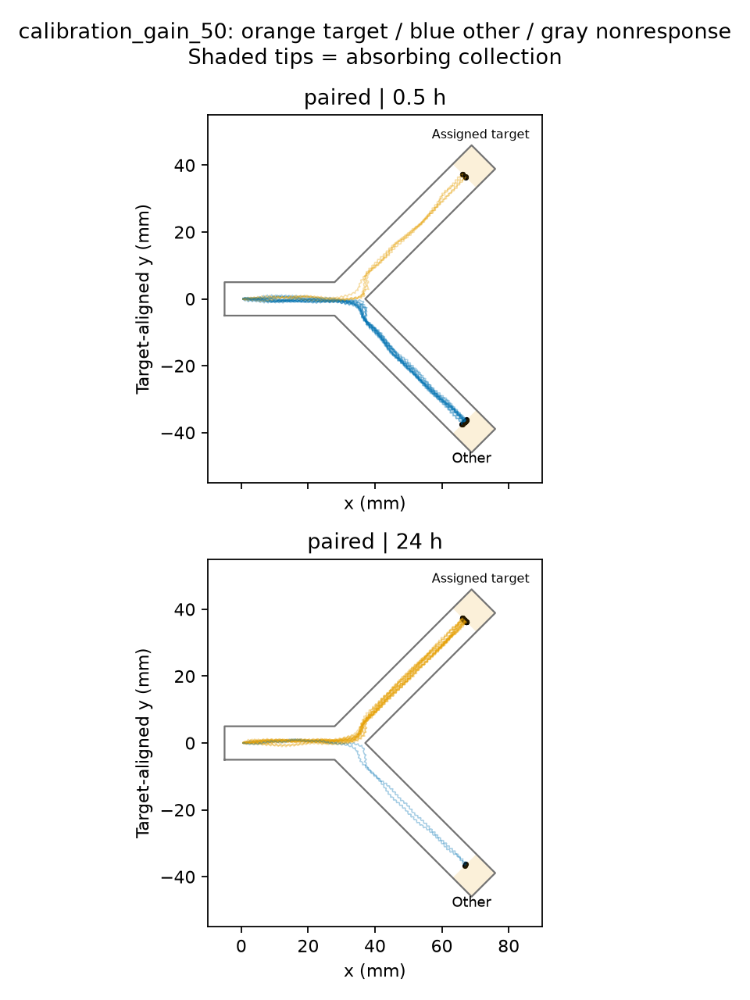
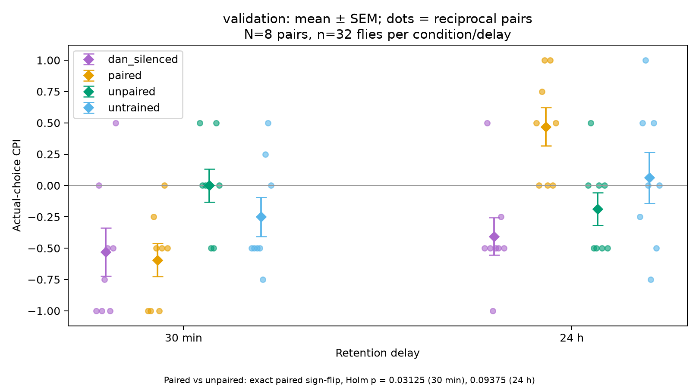
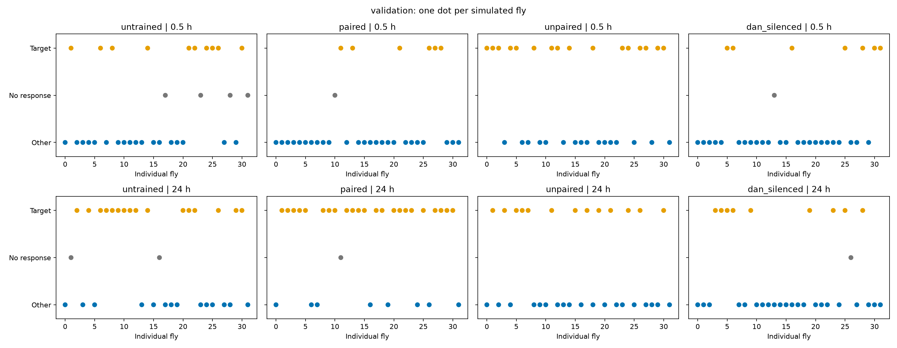
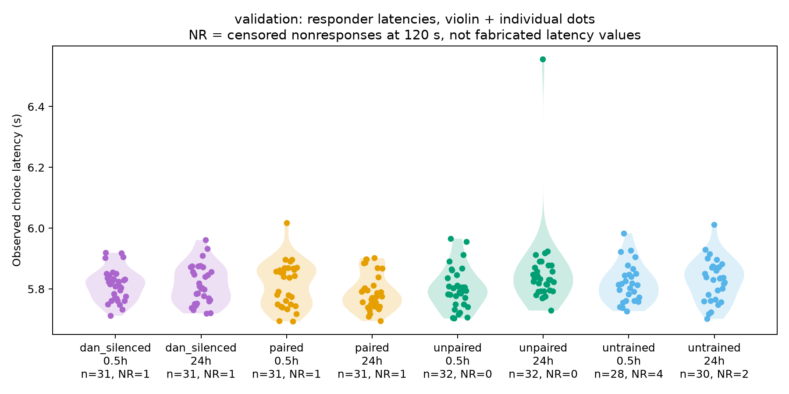
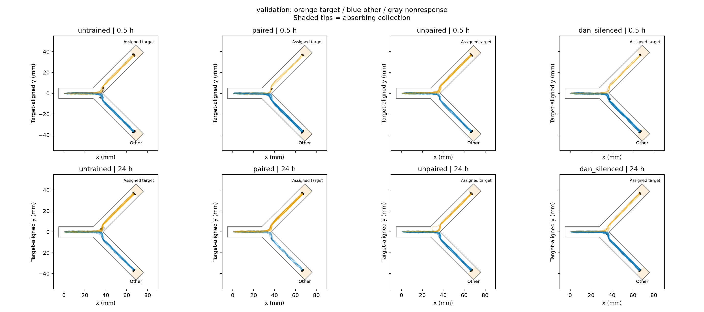

# individual_behavior_v4b results

V4 gains 5 and 20 lacked early aversion; gain 80 saturated late preference. This is adaptive model development, not independent confirmation.

Status: validation completed.

V3 is unchanged. New variability is explicitly modeled, not evidence of measured biological heterogeneity. No quantitative reproduction claim.

Overall declared validation: FAILED. Failed criteria: primary_contrasts_pass.

Individual choice variation and the expected early/late direction were observed, but the entire predeclared statistical gate must pass before claiming validation. No post-validation retuning or exclusions were performed.

## Paper versus simulation

Compare the paper's panel b with our paired-condition CPI plot. Panels c/d
(persistence and shock resistance) have not been reproduced. Original paper
axes are preserved and differ from the simulation axes.

| Detail | Kaun et al. Figure 1b | Current simulation |
|---|---|---|
| Outcome direction | Early aversion, late preference | Same directions, not quantitative replication |
| Replication | N=8 reciprocal pairs; 50 flies per odor group | N=8 pairs; 2 flies per odor group, 32 per condition/delay |
| Error bars | Mean ± SEM across replicates | Mean ± SEM across reciprocal pairs, not individual movement spread |
| Tests versus unpaired | Wilcoxon two-sample, p=0.006 / 0.02 | Exact paired sign-flip, Holm p=0.03125 / 0.09375 |
| Overall validation | Biological experiment | FAILED declared gate: late contrast did not pass |
| Time dependence | Independently observed biology | Both times informed calibration; new seeds are not new biological evidence |

The assumed memory mechanism still changes sign too early. Larger N can improve
precision but cannot repair incorrect mechanisms or establish biological validity.
No post-validation tuning or selective exclusions were made.

[Paper source](https://pmc.ncbi.nlm.nih.gov/articles/PMC4249630/) · [Figure attribution](PAPER_ATTRIBUTION.md)

## Public data

Full per-fly records and failed calibration history:
[Hugging Face dataset](https://huggingface.co/datasets/Histochemichael/fly-sud-simulation).
Code and protocols: [GitHub](https://github.com/histochemichael/fly-sud-simulation).
Dataset raw paths are under raw/v4/ and raw/v4b/. Earlier V1 GitHub releases
remain separate and must not be pooled with these runs.

## Actual CPI results

Dataset | Condition | Delay h | Flies | Reciprocal N | Target / other / none | CPI ± SEM
---|---|---:|---:|---:|---|---:
calibration_gain_50 | paired | 0.5 | 16 | 4 | 4/12/0 | -0.500 ± 0.354
calibration_gain_50 | paired | 24 | 16 | 4 | 14/2/0 | 0.750 ± 0.144
validation | dan_silenced | 0.5 | 32 | 8 | 7/24/1 | -0.531 ± 0.192
validation | dan_silenced | 24 | 32 | 8 | 9/22/1 | -0.406 ± 0.149
validation | paired | 0.5 | 32 | 8 | 6/25/1 | -0.594 ± 0.133
validation | paired | 24 | 32 | 8 | 23/8/1 | 0.469 ± 0.153
validation | unpaired | 0.5 | 32 | 8 | 16/16/0 | 0.000 ± 0.134
validation | unpaired | 24 | 32 | 8 | 13/19/0 | -0.188 ± 0.132
validation | untrained | 0.5 | 32 | 8 | 10/18/4 | -0.250 ± 0.157
validation | untrained | 24 | 32 | 8 | 16/14/2 | 0.062 ± 0.205

## Declared validation criteria

{
  "correct_direction": true,
  "nonsaturated_magnitude": true,
  "mixed_paired_choices": true,
  "controls_near_zero": true,
  "response_at_least_80_percent": true,
  "no_physics_failures": true,
  "primary_contrasts_pass": false,
  "seed_independence": true,
  "physical_audit": true
}

## Primary statistics

[
  {
    "delay_h": 0.5,
    "n_reciprocal_pairs": 8,
    "contrast": "paired minus unpaired",
    "difference": -0.59375,
    "p_raw": 0.015625,
    "test": "exact two-sided paired sign flip",
    "p_holm": 0.03125
  },
  {
    "delay_h": 24.0,
    "n_reciprocal_pairs": 8,
    "contrast": "paired minus unpaired",
    "difference": 0.65625,
    "p_raw": 0.09375,
    "test": "exact two-sided paired sign flip",
    "p_holm": 0.09375
  }
]

## Interpretation

CPI error bars are SEM across reciprocal replicate pairs, not individual fly movement variance. They quantify Monte Carlo replicate uncertainty under assumed individual distributions, not empirically calibrated biological variability. Each individual contributes one observed target/other/nonresponse score. Both individual choices and aggregate CPI are reported.

The paper reports early aversion and late preference with N=8 and mean ± SEM. Our early/late timing points were used in calibration and are not held-out timing evidence. Independent seeds test model repeatability, not biological validity.

The time-course mechanism was NOT fixed in this behavioral experiment: the V3 consolidating model retains its too-early sign crossing. Comparing memory mechanisms against separately specified time-course data is still required.

Stationary validation nonresponses: 10 (less than 1 mm spatial extent in the last 10 physical seconds). These remain in CPI denominators and are not interpreted as evidence of aversion.

The active V4 steering gain is behavioral_gain. Legacy turn_gain, motor_value_gain and motor_denominator_floor fields remain in inherited configurations but are not used when individual_controller_v4 is true.

All flies share one reference FlyWire connectome subset, with distinct seeded experiences and parameter profiles; these are not individually measured connectomes. Its anatomy does not specify the assumed noise, kinetics or motor equations. Dopamine is a simplified retrieval gate, not mechanistic DAN-to-KC learning.

The earlier open-arena experiment allowed a wider spread of paths; these physical Y-maze walls and obstacle/upwind reflexes constrain movement into corridors. Similar-looking paths within an arm are not the same thing as unanimous choices. Trajectory spread alone is not a target to fit. All assigned targets in control conditions are bookkeeping labels, not reward delivery sites.

Compute: local Intel Core i7-9700F, eight CPU workers, MuJoCo CPU dynamics. No GPU acceleration used for these trials.

## Data access

individual_manifest.csv indexes each fly, seed, outcome and trial directory. Each directory contains individual_configuration.json; state_history.parquet; physics_history.parquet; learning_history.parquet; learning_states.npz with naive/post-training/pre-test/final per-KC arrays and exact FlyWire root IDs; replay.npz; and summary.json. Use dataset plus fly_id as the unique key across gain candidates. Calibration candidates deliberately reuse matched individual seeds; validation does not.

Source: [Kaun et al. (2011), Figure 1 and Methods](https://pmc.ncbi.nlm.nih.gov/articles/PMC4249630/)

## Figures

